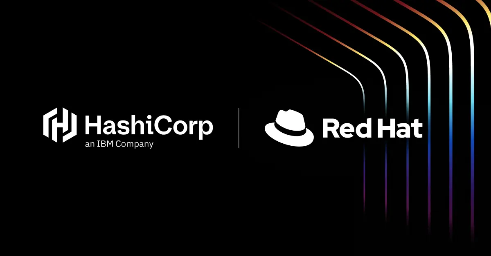
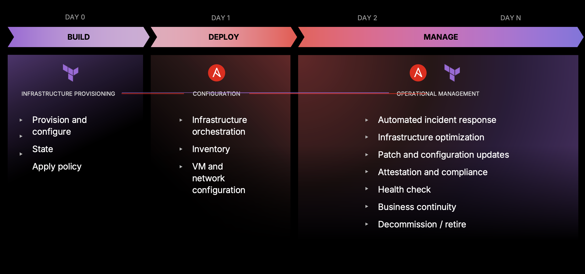
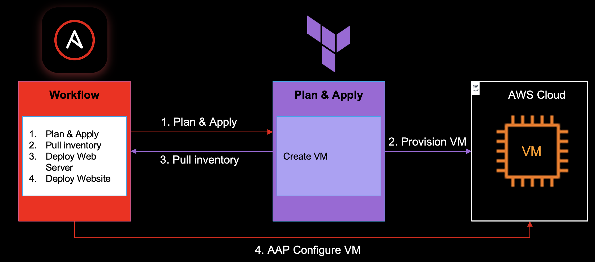
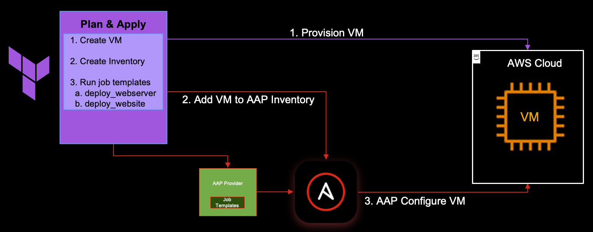
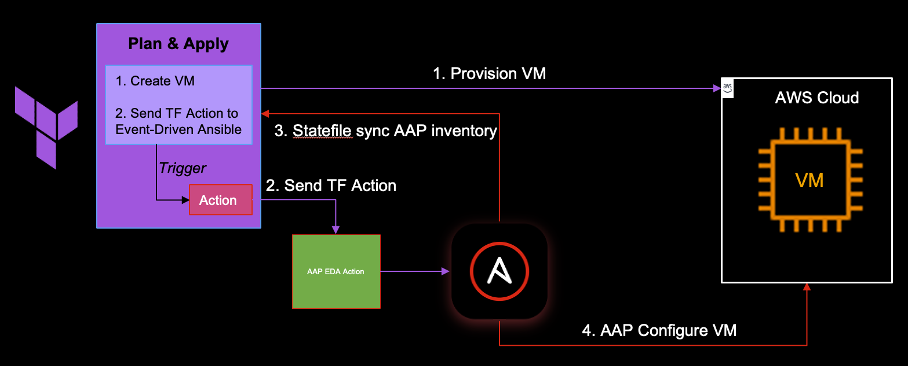
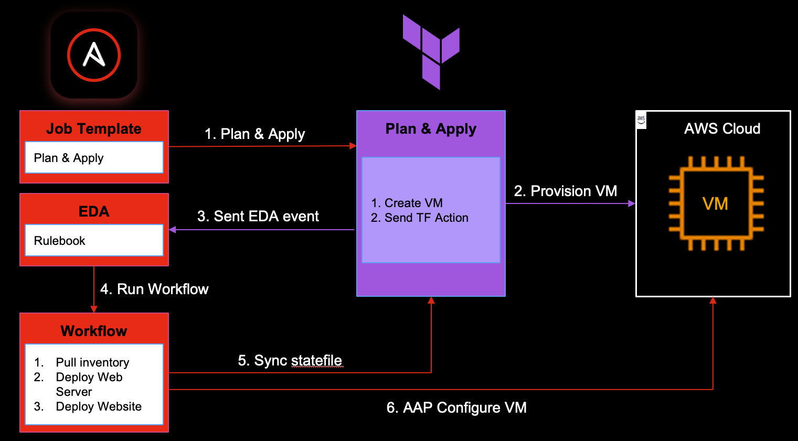

# Welcome at the Terraform ❤️ Ansible Better Together Workshop

📆 Date: December 4th 2025

📍 Location: Live at the Innovation Studio, IBM Netherlands BV

## Abbreviations

| Abbreviation | Definition |
| --- | --- | 
| AAP | Red Hat Ansible Application Platform |
| ALB | Application Load Balancer |
| EDA | Event Driven Ansible |
| AWS | Amazon Web Services |  
| CI/CD | Continuous Integration, Continuous Deployment/Delivery | 
| HCP | HashiCorp Cloud Platform |
| HCP Terraform | Terraform running on HCP (SaaS) |
| RHEL | Red Hat Enterprise Linux | 
| VCS | Version Control System | 
| VMs | Virtual Machines |

## Introduction 

In today’s hybrid and multi-cloud world, there has been an explosion of new applications, tools, and services that organizations can now use to become more efficient. But as the number of providers and services used increases, it gets increasingly harder for clients to manage their infrastructure across public clouds and on-premises infrastructure. The effort to build and maintain these will push far beyond the capacity of humans to support, magnifying organizational risk and complexity.

This new landscape prompts the need for more effective Infrastructure Lifecycle Management that uses automation to build (Day 0), deploy (Day 1), and then manage (Day 2+) infrastructure over time:
| Operations | Task | Description |
| --- | --- | --- |
| Day 0 | Build | represents the initial provisioning of the infrastructure resources in question. It’s “0” (zero) in that nothing else can be done to said infrastructure before it even exists. |
| Day 1 | Deploy | refers to what happens after a unit of infrastructure is provisioned. It focuses on how a particular set of resources are configured. |
| Day 2+ | Manage | refers to the ongoing management and optimization of infrastructure after it is provisioned and configured. This includes health monitoring to ensure infrastructure stays in its desired state and decommissioning once it is no longer needed.|

HashiCorp Terraform is widely adopted for Day 0/1 CRUD operations, offering a declarative, reproducible, and version-controlled approach to infrastructure provisioning. However, organizations adopting hybrid cloud infrastructure quickly find that effectively managing infrastructure over time requires much more than just initial provisioning. 

Terraform and Ansible are two of the most widely used tools in infrastructure management. With Terraform serving Day 0 infrastructure provisioning needs and Ansible excelling at configuration management, together they form a solid foundation for standing up infrastructure.

## What you will learn during the workshop

In this workshop, you will learn how HCP Terraform and Red Hat Ansible Automation Platform (AAP) integrate to deliver end-to-end automation and consistent infrastructure management across any environment at scale.

- How HCP Terraform and AAP work together to simplify infrastructure provisioning and enforce consistent configuration
- Real-world workflows that speed up delivery, while reducing manual effort and costs, to help companies manage hybrid environments at scale over time
- Best practices for eliminating drift and securing infrastructure across environments

By the end of the workshop, you will have gained a solid understanding of the synergy between Red Hat and HashiCorp technologies on infrastructure provisioning and configuration management.

## Prerequisites
Participants are expected to be familiar with general application development and infrastructure concepts including:

- A general understanding of VMs and Instances 
- A general understanding of Git
- GitHub Account
- Basic development or operations-focused skills (e.g. CI/CD experience)
- A laptop running Windows, macOS, or Linux with a Chromium-based web browser

As already presented to you as part of the workshop:
- HCP Terraform is great at standing up and tearing down cloud infrastructure based on a blueprint
- AAP is great at configuring the 'inside' of this infrastructure and orchestration across technologies.
So, using them together is actually a wonderfull idea. And we ([Red Hat](https://www.redhat.com) and [HashiCorp](https://www.hashicorp.com)) have been hard at work to give you integrations in both offerings.

During this workshop you will learn the various aspects of this integration. The goal of this workshop is to deploy a website in AWS.

We let the different tools do the things they are good at:
- HCP Terraform will create the needed infrastructure in AWS.
- AAP will install a web server and website on this infrastructure.

To start of, you need to prepare both HCP Terraform and AAP and create some objects and components in both, preferably in this order:
1. For HCP Terraform specific instructions for this prep work go [here](https://github.com/TechXchangeNL/terraform/tree/main/README.md)
2. For AAP specific instructions for this prep work go [here](https://github.com/TechXchangeNL/ansible/blob/main/README.md)

> [!NOTE]  
> Some prep work is dependent on other prep work to be done first. When that is the case, it is described as such.

> [!WARNING]
> Every change in your GitHub repository will cause a Terraform plan to run. Don't worry.
> Since your workspace is not configured with auto-approve it will stop after the plan and you can 'Cancel/Discard the run' when needed.

## Scenario's

Now, let's use these "building blocks" to build and try out some scenario's. Perform the scenario's in the desgnated order. Each scenario should end up in a working website.

### Scenario 1: Orchestrate from Red Hat Ansible Automation Platform

In this scenario you create the following setup:
1. In AAP: Complete/Adjust the apply_plan playbook to have HCP Terraform create the infrastructure in AWS and make a Job Template for it.
2. In AAP: Develop a workflow that does the following (in this order):
   - Define step 1: Job template with apply_plan playbook
   - Define step 2: Sync statefile from HCP Terraform (terraform source)
   - Define step 3: Job template with deploy_webserver playbook
   - Define step 4: Job template with deploy_website playbook
3. In AAP: Run the workflow
4. Test if the website is alive
5. Celebrate your victory :tada:
6. In HCP Terraform: Cleanup infrastructure (see below)

### Scenario 2: Orchestrate from HCP Terraform 

In this scenario you create the following setup:
1. In HCP Terraform: Create a Terraform plan that does the following (in this order):
   - Create an EC2 instance in AWS /* created as part of the Terraform bulding block */
   - Create an inventory in AAP
   - Run the Job Template with the deploy_webserver playbook in AAP
   - Run the Job Template with the deploy playbook deploy_website in AAP
2. In HCP Terraform: Apply the plan
3. Test if the website is alive
4. Celebrate your victory :tada:
5. In HCP Terraform: Cleanup infrastructure (see below)

> [!TIP]  
> In this scenario we are going to use the [aap terraform provider](https://registry.terraform.io/providers/ansible/aap/latest/docs) to dynamically create the inventory and job_templates
> 1. Add aap provider in the providers.tf
> 2. Create an aap_job.tf in your GitHub repository and add code to create an inventory and job_templates
> aap_job.tf contains 2 data objects and 2 resources and some resources are dependent on another resources
> 3. Create an aap_inventory.tf in your GitHub repository and add code to create an inventory
> aap_inventory.tf contains three resources and optional two data objects or just use hard-coded values 😉
> 5. Make sure the job templates in AAP have "Prompt on lauch" enabled

### Scenario 3: Orchestrate from HCP Terraform using Terraform Actions and EDA

In this scenario you create the following setup:
1. In AAP: Develop a workflow that does the following (in this order):
   - Define step 1: Sync statefile from either HCP Terraform or AWS (terraform or AWS source)
   - Define step 2: Job template with deploy_webserver playbook
   - Define step 3: Job template with deploy_website playbook
   - Make sure the workflow has `prompt on lauch` enabled for `extra vars`
2. In HCP Terraform: Create a Terraform plan that does the following (in this order):
   - Create an EC2 instance in AWS
   - Emit an event to AAP EDA using a Terraform Action. Let the event pass the workflow name and type you made in AAP.   
3. In AAP: Make sure you have done the EDA building blocks
4. in HCP Terraform: Apply the plan
5. In AAP: Monitor if the event will trigger the workflow
6. Test if the website is alive
7. Celebrate your victory :tada:
8. In HCP Terraform: Cleanup infrastructure (see below)

> [!TIP]  
> In this scenario we are going to use [Terraform Actions](https://danielmschmidt.de/posts/2025-09-26-terraform-action-patterns-and-guidelines/) to send an event to AAP EDA
> 1. Create an aap_eda.tf in your GitHub repository and add code to create action aap_eda_eventstream_post
> 2. Add a lifecycle trigger in the aws_instance resource

> [!TIP]
> Open your running rulebook activation in AAP EDA, select the `history` tap and click the running activation.
> Reuse the aap_inventory.tf from scenario 2

### Scenario 4: Orchestrate from AAP using Terraform Actions and EDA 

In this scenario you create a setup that does the following:
In this scenario you create the following setup:
1. In HCP Terraform: Create a Terraform plan that does the following (in this order):
   - Create an EC2 instance in AWS
   - Emit an event to AAP EDA using a Terraform Action  
2. In AAP: Develop a workflow that does the following (in this order):
   - Define step 1: Sync statefile from either HCP Terraform or AWS (terraform or AWS source)
   - Define step 2: Job template with deploy_webserver playbook
   - Define step 3: Job template with deploy_website playbook
   - Make sure the workflow has `prompt on lauch` enabled for `extra vars`
3. In AAP: Make sure you have done the EDA building blocks
4. In AAP: Create a job template for the apply_plan playbook (adjust the playbook if needed)
5. In AAP: Run the job template and monitor if the event will trigger the workflow
6. Test if the website is alive
7. Celebrate your victory :tada:
8. in HCP Terraform: Cleanup infrastructure (see below)

> [!TIP]
> 1. Most of the work done in scenario 3 also applies here, see that scenario for specifics.
> 2. **Ask yourself**: What is different between scenario 3 and 4?

### Scenario 5 - 8: Increase capacity / resiliency

Repeat the previous 4 scenarios, but now create 2 instances in AWS behind a load balancer (ALB). Make sure the web site is reachable behind the load balancer and served by both webservers. The website is made such that you can see that it is behind a load balancer.

### When you finish early

Play with the provided building blocks to experiment at will.

## Cleanup

To help manage cloud costs effectively, we prefer you queue a destroy run to clean up the resources after you finish each scenario and when you finish the workshop. Hugues will be very 😃. You can do so by queuing a destroy run in the your previously created HCP Terraform workspace. 

Remember that to properly clean up the resources, each of the child workspaces must not have any **apply** or **destroy** runs currently in progress or pending.

To clean up all resources from your provisioned workspaces, follow these steps:

- In your provisioned workspace, navigate to the **Settings** tab on the left-side navigation panel
- Click on **Destruction and Deletion**
- Scroll down and click the red box labeled **Queue destroy plan**
- Enter the name of the workspace and confirm the destroy

